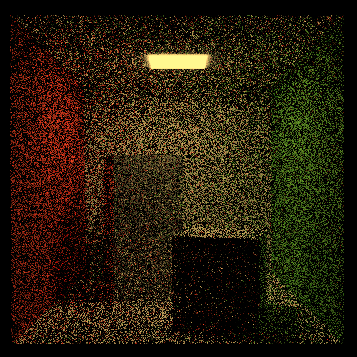
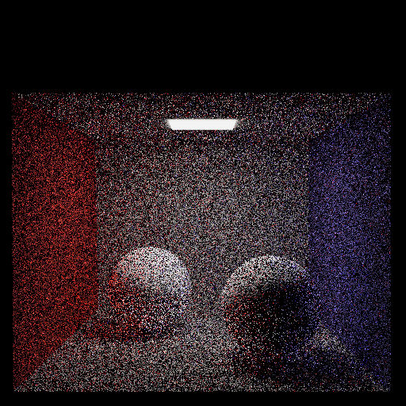

## Path (milestone)

Please fill this out and submit your work to Gradescope by the milestone deadline.

### Output Comparison
Run the program with the specified `.ini` config file to compare your output against the reference images. The program should automatically save to the correct path for the images to appear in the table below.

Please take a look at the program parameters contained in the `.ini` files: **your program must respond to changes to these parameters**. If you are using the Qt stencil code, these parameters can be accessed via the `settings` member variable of the `PathTracer` class. 

If you aren't using the Qt framework, you may also produce your outputs otherwise so long as you place them in the correct directories as specified in the table. In this case, also describe how your code can be run to reproduce your outputs.

> Qt Creator users: If your program can't find certain files or you aren't seeing your output images, make sure to: 
> 1. Set your working directory to the project directory
> 2. Set the command-line argument in Qt Creator to `template_inis/milestone/<ini_file_name>.ini`

Note that your outputs do **not** need to exactly match the reference outputs. There are several factors that may result in minor differences, such as your choice of tone mapping and randomness.

Please do not attempt to duplicate the given reference images; we have tools to detect this.

| `.ini` File To Produce Output | Expected Output | Your Output |
| :---------------------------------------: | :--------------------------------------------------: | :-------------------------------------------------: |
| cornell_box_milestone.ini |   |  |
| sphere_milestone.ini |  |  |

> Note: The reference images above were produced using the [Extended Reinhard](https://64.github.io/tonemapping/#extended-reinhard) tone mapping function with minor gamma correction. You may choose to use another mapping function or omit gamma correction.

<!-- ### Design Choices

### Collaboration/References

### Known Bugs

### Extra Credit -->
